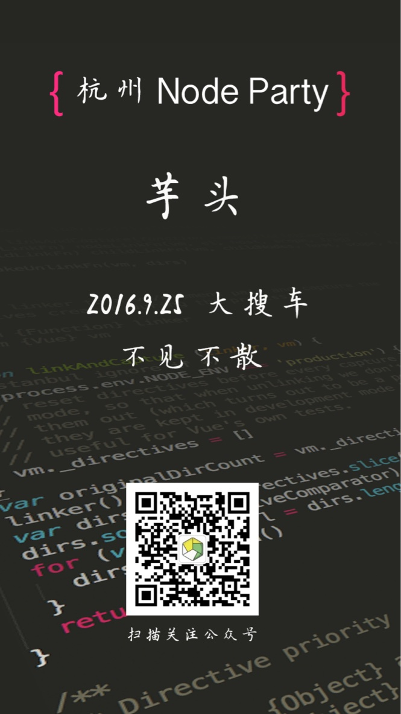
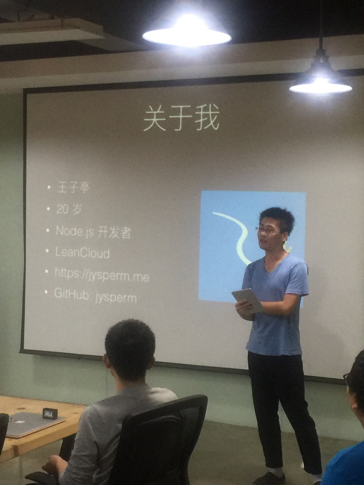
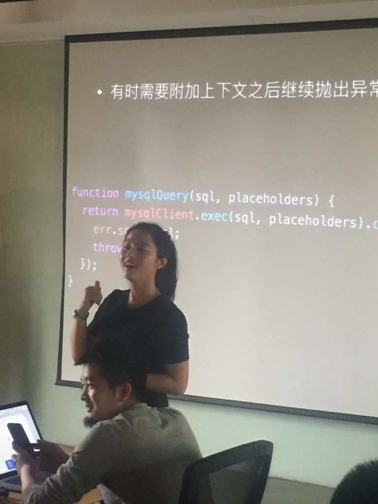
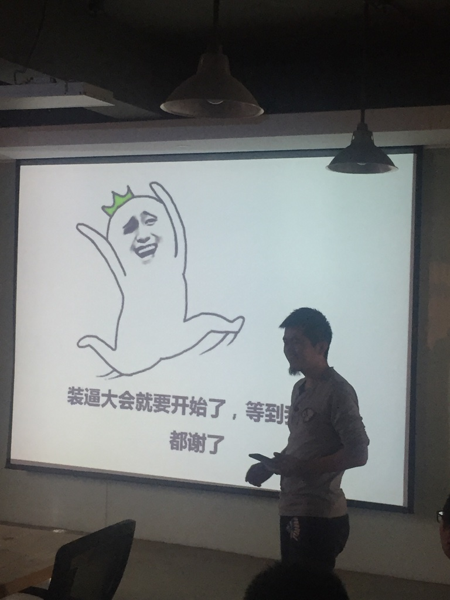
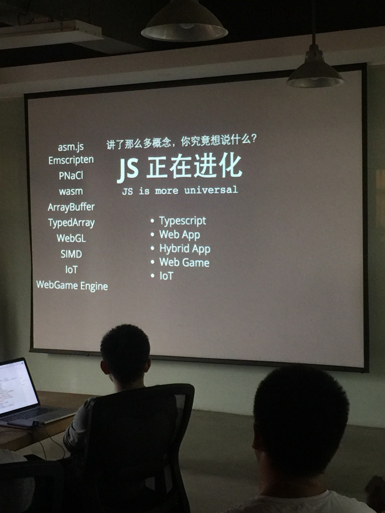

本周末（9 月 25 日）下午 2 点到 5 点，第二届搜车 Node Party 成功举办。

### 关于杭州 Node Party

杭州 Node Party 是由大搜车（Souche Inc.）发起的一个面向 Node.js 爱好者的技术分享聚会，希望能够构建一个持续的分享学习的平台，一起发展 Node.js 生态。

> 大搜车是国内领先的二手车 / 新车服务提供商，主营车源市场 / SAAS 服务 / 金融 / 新车金融 / 后市场服务等，目前车源市场 App 的服务端均由 Node.js 支撑，并在公司内部提供多套基础核心服务。大搜车前端研发部 是本活动的唯一 场地和资金 赞助方。

### 本次活动总结

本次 Node Party 有几个比较特别的地方:

 1. 第一次有了主持人,本次特邀美女教师 十一 主持活动,十一老师现在是幼儿教师,之前在技术社区 SegmentFault 工作过,有着丰富的勾搭程序员的技能,她还有一个身份就是 @芋头 的老婆 [害羞].
 2. 本次主讲人 从各地过来,从各个公司过来。并且本次活动,一起确认了接下来几期的讲师阵容,对于大家积极参与社区分享的热情,很是开心,这个事情我们可以持续做下去了,各出一份力。
 3. 会后,@hehe123 周杰老板带我们去他家的 @敏厨房 吃了一顿丰盛的晚餐,很开心和诸多大牛一起吹水。
 4. 感谢本活动第一个赞助商 @Jongwu 赞助的11件个性T恤,下次活动,我们有更重磅的赞助,为大家造福是我们应尽的义务。
 5. 本次活动,我们给每个参会者制作了一个海报,另外还麻烦公司的设计师给我们做了易拉宝,虽然最后没有来得及打印出来,但是说明我们的活动正在越做越完善,而这离不开大家所有人的支持和帮助。

本次活动,我们创建了自己的公众号:杭NodeParty,可以通过 hz-nodeparty 搜索关注,也可以扫描以下二维码关注,会不定期推送相关资讯和活动信息。

本次活动,报名90人,参与大概50多人,下次活动我们会尝试小额收费,杜绝报名后不参与的现象哈。

### 本次活动话题

第一个话题为精子大大的《Node Error Handling》。

主要讲述了在不同的编程模式下错误处理的一些方法和问题,另外跟大家探讨了应用中错误处理的最佳实践。

[Slide 链接](./Node Error Handling.pdf)

第二个话题为慕课网上知名的 Scott 大犇，也是 CampusRoom 的技术负责人主讲，《创业团队撸 Node》。

讲述了创业公司在 Nodejs 中的实践,语言幽默又不失黄暴,引人入胜,让诸多屌丝创业公司同仁深有同感。

[Slide 链接](./创业团队撸 Node（董必正_Scott）.pdf) 

第三个话题为阿里云的艾多（Adoyle）献上的《JS 漫谈》。

讲述了 JS 在一些特殊领域的发展,大部分人都听的比较懵逼,真的是开阔眼界之佳作。

[Slide 链接](http://slides.com/adoyle_h/xia-che-dan#/)

### 加群

另外,还是欢迎大家加入我们的微信群,参与讨论交流。群已满，请扫描以下二维码添加芋头叔叔微信拉你进群，请注明：公司职位以及请求加入 Node.js 群）

### 照片

#### 邀请函

#### 精子大大

#### 主持人

#### Scott 大大

#### Adoyle
