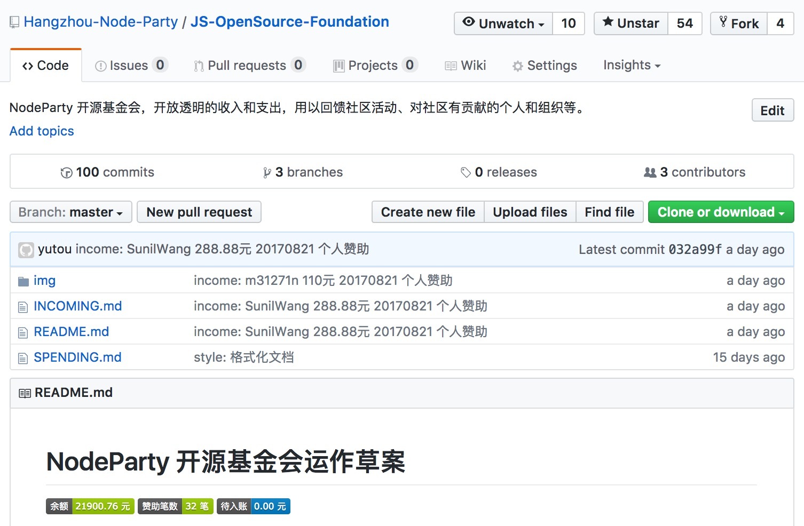
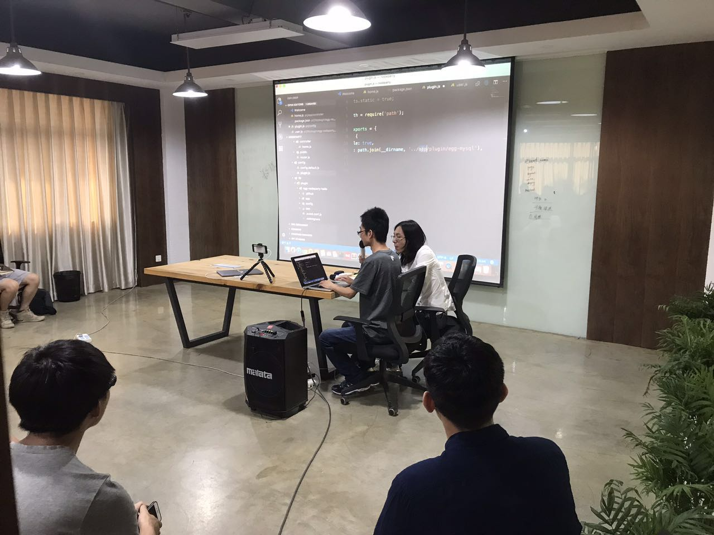
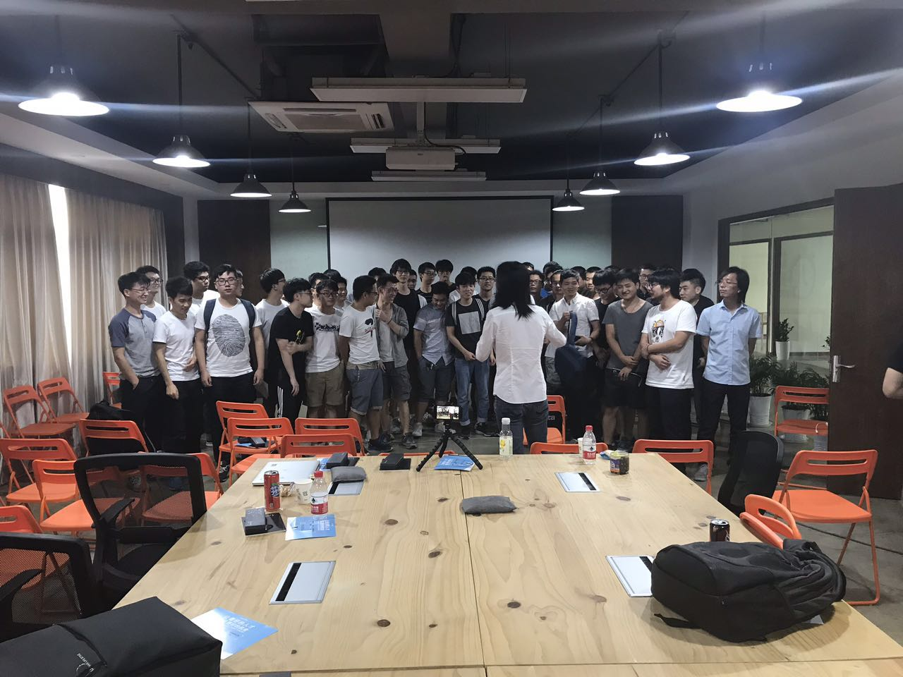
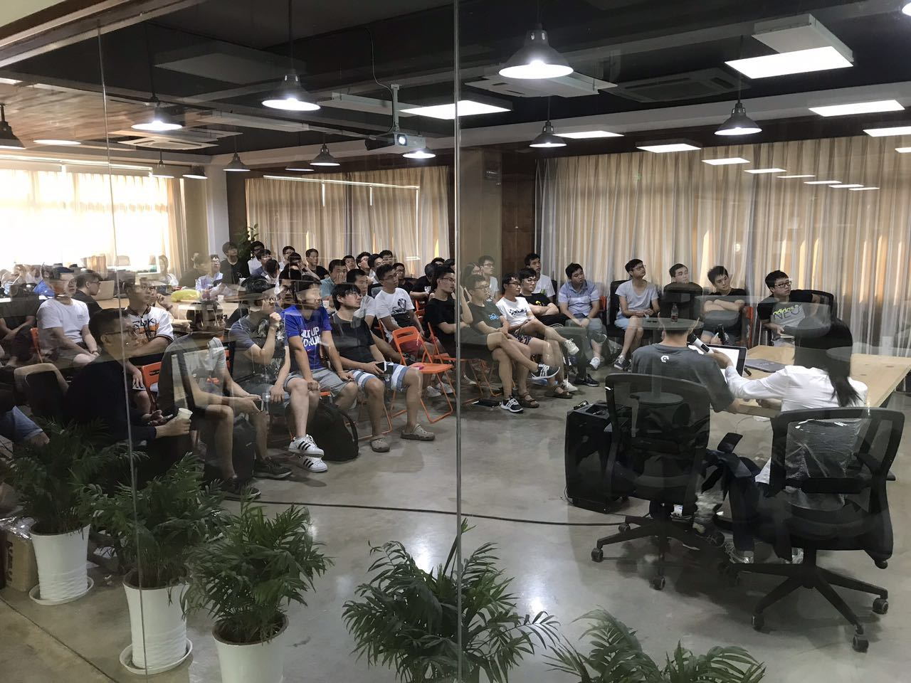
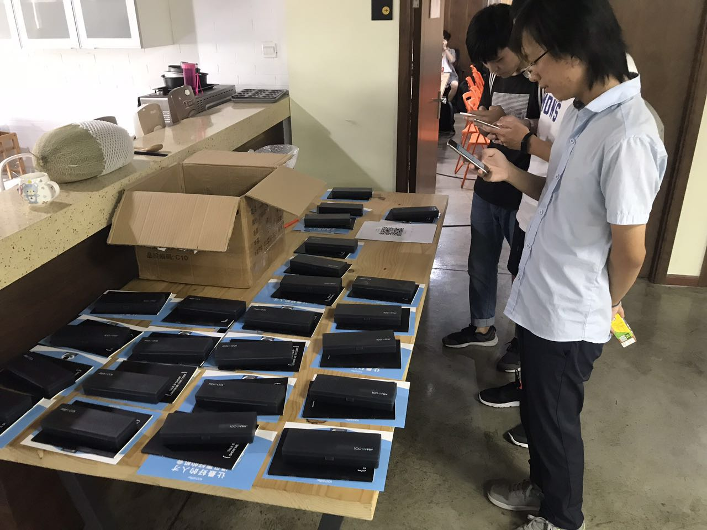
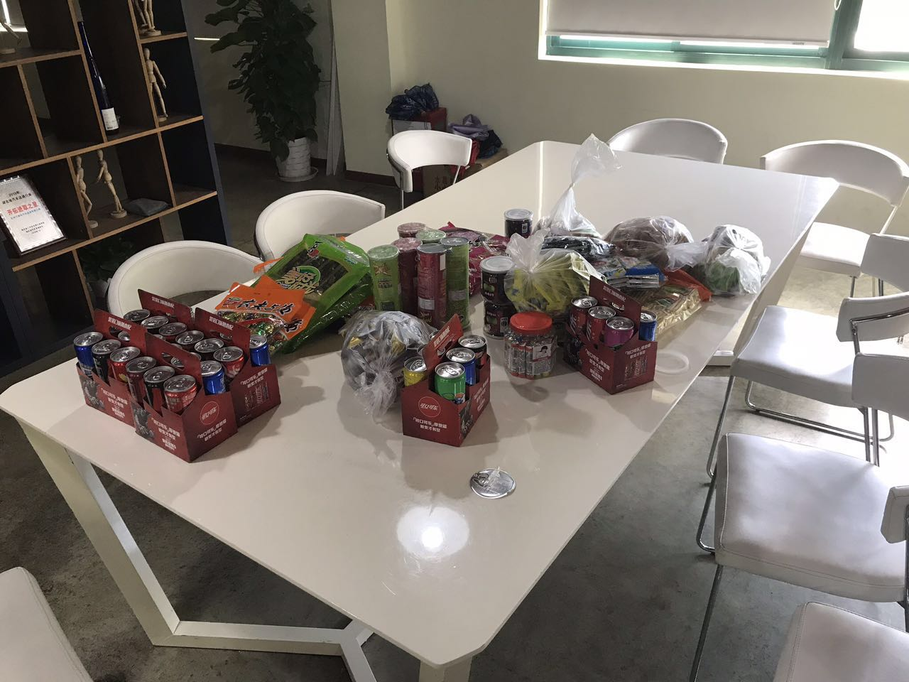
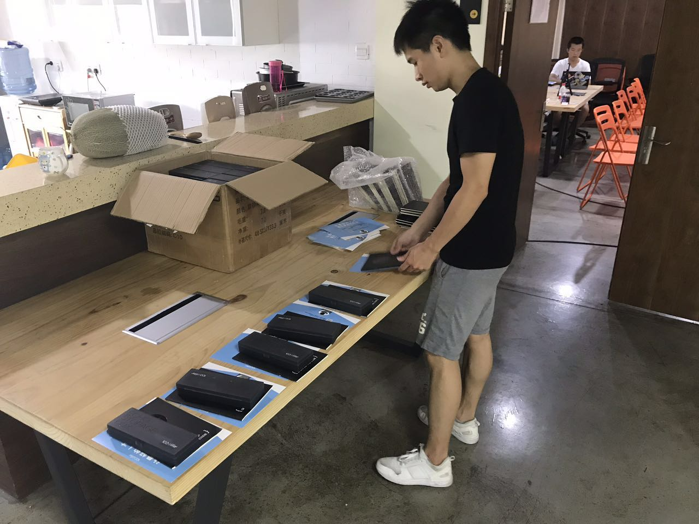
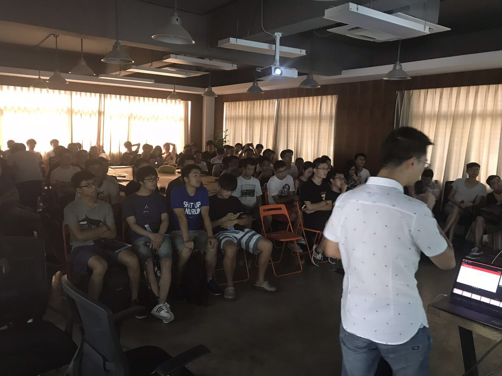

# 杭州 NodeParty 第四期总结

## 开场

本期 NodeParty 又有几个新的突破，先跟大家介绍下。

### 1. 我们有钱了！

本次我们有一个突破性的想法，并将其付诸实践，那就是 NodeParty 开源基金会。

NodeParty 开源基金会是一个新型的、纯公益性质的、开源的基金会，建立此开源基金会的初衷是利用社区活动或者企业赞助产生的资金，不计回报地回馈给社区。例如支持社区相关活动的支出、支持在社区有突出贡献的个人开发者，以及在社区有贡献的小型初创公司等。

目前，在没有大规模宣传的背景下，基金会已经收到 32 笔共 21900.76 元赞助款，其中包含一些企业的大额赞助、软件组织以及诸多个人开发者的赞助。

这件事情最有意义的事情在于，我们以后的社区活动有了可以自己支配的资金，以此，我们可以不必受制于资金相关条件的制约。

欢迎更多企业以赞助者的身份合作（提供一些宣传上的支持）。

我们有严谨的流程来保证资金的安全和公正，详见[基金会文档](https://github.com/Hangzhou-Node-Party/JS-OpenSource-Foundation)

### 2. 我们有了更多伙伴的支持

之前几期的活动，其实办下来流程、服务、气氛上都有些尴尬，因为基本是我在组织，团队的几个同学做一些行政上的支持，很多东西不是我们擅长的，所以搞起来又吃力效果又不好。

但是这次不一样了，有更多的人加入了我们的组织者群体，而且我们还有一个新的基金会组织，大家都在尽心尽力为活动付出，在此特别感谢一下这些人。

* 感谢串场经验爆棚的女装大佬闪总，除了流畅的串场，还组织了最后一个圆桌环节，非常成功。
* 感谢我司（大搜车）人力资源部的培训负责人 晶姐姐，为大家准备报名、签到、问卷，以及活动中的行政工作支持。
* 感谢基金会成员以及基金会的赞助者，让我们得以有自己的资金组织本次和后续的活动。
* 感谢讲师团，感谢贺老，感谢死月大佬为大家问道解惑，感谢其他已经分享过以及即将参与分享的所有讲师的支持。
* 感谢所有报名参与者，报以最好的善意理解支持我们的工作。
* 感谢所有志愿者，搬桌子，准备礼品，带领入场，清理场地等，没有你们，活动同样无法举办。

### 3. 其他

* 本次直播，我们尝试在流行文化集中地 B 站直播，大概有 3000 人围观，另外我们也在讲师电脑上录制了视频，因为视频都比较大，所以可能稍后才会放出。
* 本次现场，我们和一些对社区活动非常热衷的同学做了一些交流，对未来杭州社区活动有了一些新想法。
* 本次活动的门票收入均以讲师名义赞助给 NodeParty 基金会（[赞助记录](https://github.com/Hangzhou-Node-Party/JS-OpenSource-Foundation/issues/37)）。

## 本场分享 Slide

* [TurboFan + Ignition](./TurboFan+Ignition.pdf)  @TimothyGu Nodejs 核心开发者
* [数据可视化科普](./visualization_node_party.pdf) - [视频](https://www.bilibili.com/video/av13568635/) @[GeekPlux](https://github.com/geekplux) 数据可视化方向研究生
* [Egg.js在阿里巴巴集团的的实践运用](./Egg.js在阿里巴巴集团的的实践运用.pdf) @庄少 天猫技术专家
* [从0构建大规模nodejs应用](./从0构建大规模nodejs应用.pdf) @曾通 京东Nodejs开发

## 现场照片

