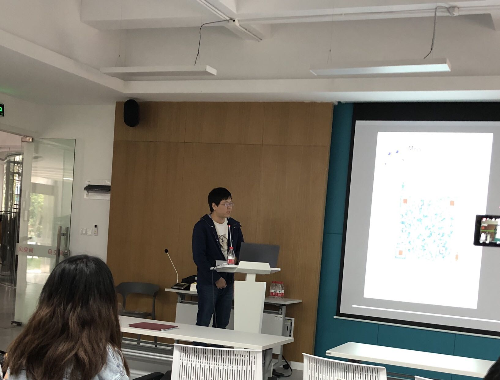
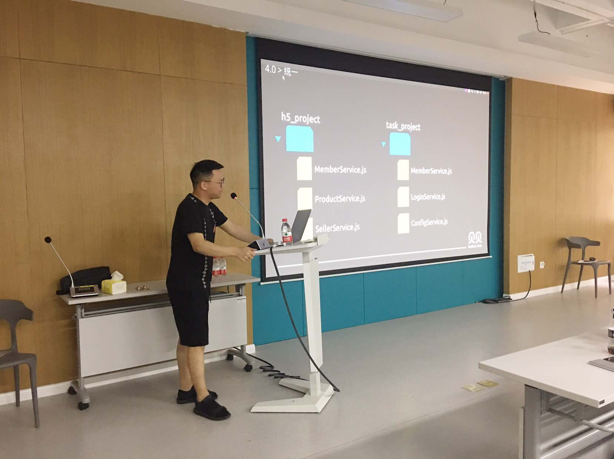
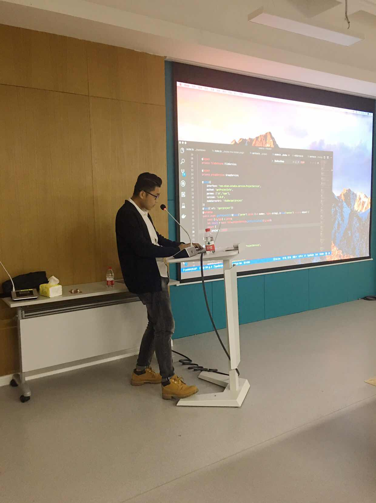
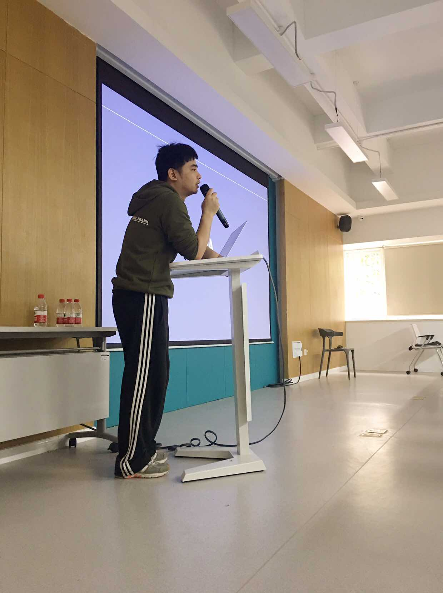
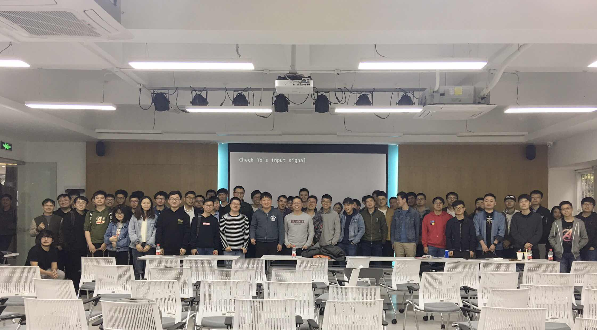

# 第九期杭州 NodeParty 回顾
## 活动说明

本次活动由 [贝贝集团](https://www.beibei.com/) 主办。

* 时间：2019 年 4 月 13 日 13:00 - 18:00
* 地点：杭州市江干区九盛路9号东方电子商务园12幢1楼

### 开场

芋头以“三弹”做为开场致辞。他讲到，Node.js 不是银弹，而且会因为生态还没有Java那么成熟，会是一个炸弹。Node Party 的一个意义，就是经验共享，让这个炸弹，变成为我所用的导弹。Node Party 我们会坚持走下去。

## 演讲主题

本期分享，共有四场主题演讲及两个闪电演讲：
* 第一场：应杲臻，贝贝集团，《Node 调用 dubbo 服务的探索与实践》
* 第二场：杨力，微店，《一套针对传统后端开发人员开箱即用的 Node EE 解决方案 Rockerjs》
* 第三场：陈熙旻，Rokid，《性能优化指北：通用流程和方法》
* 第四场：大猫（陈旭），中兴，《如何深深深度定制编译器才得以将编译时间从几十秒压缩到两三百毫秒？》
* 闪电分享一：[Yoda OS](https://github.com/yodaos-project/yodaos)，一个属于 Node.js 社区的物联网操作系统。
* 闪电分享二：[Scaffold Kit](https://github.com/zhangkaiyulw/scaffold-kit)，脚手架创建工具。

### 《Node 调用 dubbo 服务的探索与实践》
讲师：应杲臻，贝贝集团
[Slide](./slides/np9-1.pdf) | Video待上传

在Node.js的应用中，dubbo 使用在了 QPS 8k 的场景。那么，Node.js 中的 dubbo 使用，在贝贝集团，是怎么一路演进过来的呢？共有四次演进：
* 尝试：Node作为消费方，单点直连Java提供的服务
* 稳定：Node通过注册中心，获取服务列表，以集群方式访问服务。
* 改进：
    * 通信协议的选择：消费方和服务提供方，有众多通信协议可选择，在对比各自应用场景后，最终选择 dubbo 作为通信协议。
    * 联调。开发环境单点直连，预发环境则采用环境工厂做隔离。
* 统一：面对服务的消费方，各自定义请求，重复劳动、各自为战的情况，可以怎么做？用AST把Java服务转成npm包，实现调用统一。与此同时，服务的消费方与提供方，通过npm建联，解耦。
* 未来规划：
    * 服务代理：业务方自己维护dubbo链接，成本比较大。所以，我们打算让业务以http的方式更友好的方式访问代理，代理用dubbo和服务提供方进行通信。
    * 调用链记录：用alinode或ZipkinServer，上报调用链路。

### 《一套针对传统后端开发人员开箱即用的 Node EE 解决方案 Rockerjs》
讲师：杨力，微店
[Slide](./slides/np9-2.pdf) | Video待上传

为了满足业务的快速迭代需求，微店采用中台化的方案。而中台化的背后，需要一套完备的性能、追踪、调试等基础作为支撑。这为 Node.js 在微店的全栈化提供了土壤。

于是，微店对标 Java EE 的 Spring 框架，在 Node.js 方面，做了 Rockerjs。它提供了完善的解决方案，目前微店内部多个平台与外网服务基于此而生。本次分享，杨力分享了Rockerjs的核心理念及实现思路：
* 核心理念：容器化与IoC（注解配置）
* 容器化：标准化服务的依赖环境，让容器上提供的服务更稳定可靠。
* 调用链路：通过自动埋点，将调用信息附加到dubbo/http调用中，进行透传
* dubbo：消费方和服务提供方，通过泛化服务中转。
* 监控调试与远程debug
* ...

### 《性能优化指北：通用流程和方法》
讲师：陈熙旻，Rokid
[Slide](./slides/np9-3.pdf) | Video待上传

陈熙旻通过智能音箱唤醒的案例作为分享的开端，跟大家分享他在性能优化的方法论：
* 问题分析：拿到问题，不是直接想着解决方案，而是先分析问题，明确问题出现的场景及调用链路。
* 明确目标：在解决问题前，需要明确该问题要的解决，需要关注哪些指标、达成哪些目标，以及迭代排期。
* 解决思路：缓存、延迟、批量、惰性&预加载、并发
* 解决的结果：
    * 解决：问题得以直接解决，是最好的结果
    * 规避：查明原因但无法解决，可以通过某些方式避免
    * 兜底：查明或未查明原因时都无法解决，出现问题时自动订正
    * 搁置：可承受范围内，暂时先不管

在QA环节中，陈熙旻还分享了owner思维。即不管你身处团队中、项目中的哪个角色，你都应该以owner的角色要求自己。

### 《如何深深深度定制编译器才得以将编译时间从几十秒压缩到两三百毫秒？》
讲师：大猫（陈旭），中兴
[Slide](./slides/np9-4.pdf) | Video待上传

大猫的团队，经过2年多时间打磨了 Awade —— 一个前后端一体化的在线可视化 Web 应用开发 IDE。提升 Awade 实时编译的速度，是他的奋斗的一个目标，也是他这次分享的主题。

早期，他们尝试了浏览器发起请求，Node端通过Webpack的方式进行编译，但是最优情况整个编译过程也要2~4秒。对于可视化操作来讲，这是无法忍受的。于是，他们选择，在浏览器端，深度定制一个编译器。此次分享，包含了：Language Service Host 定制、Node能力转移到浏览器、依赖管理等方面。

---

## 现场照片

开场白：芋头

第一场：应杲臻

第二场：杨力

第三场：陈熙旻

第四场：大猫（陈旭）

合影